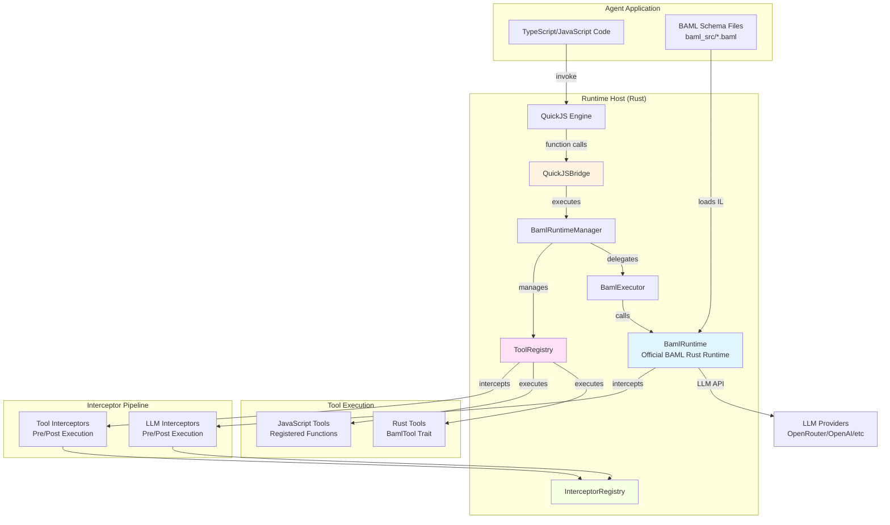
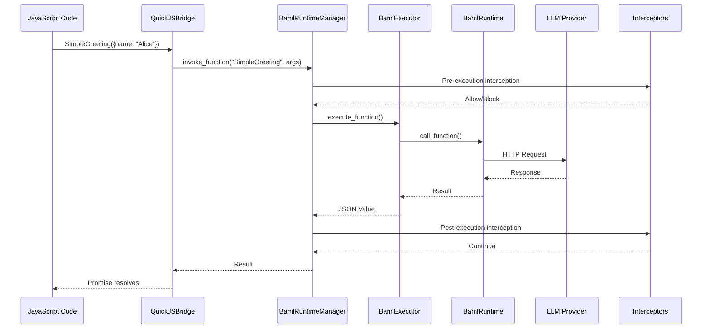
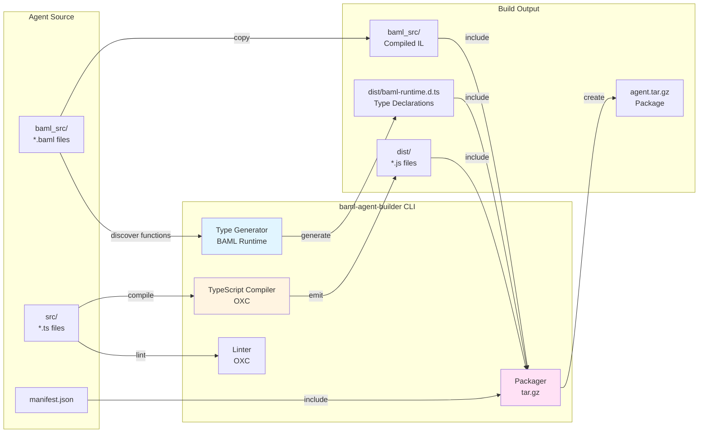
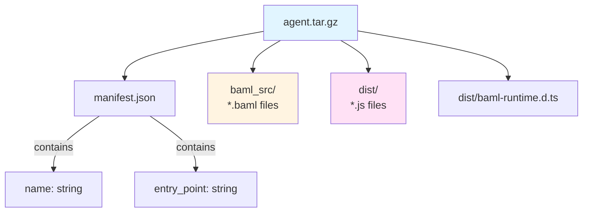

# BAML Runtime

A Rust-based runtime for executing BAML (BoundaryML) functions with QuickJS integration, enabling agent systems that combine BAML prompts with TypeScript/JavaScript application logic.

## Architecture

### Runtime Architecture



### Component Details

- **BamlRuntimeManager**: Top-level manager that coordinates function execution, tool registration, and schema loading
- **BamlExecutor**: Executes BAML functions using the official `BamlRuntime` from the BAML engine
- **BamlRuntime**: Official BAML Rust runtime (loaded from `baml_src/` directory containing compiled BAML IL)
- **QuickJSBridge**: Bridges Rust-executed BAML functions to JavaScript, allowing TypeScript/JS code to call them
- **ToolRegistry**: Manages both Rust tools (implementing `BamlTool` trait) and JavaScript tools
- **InterceptorRegistry**: Manages pipelines of interceptors for LLM calls and tool calls

### Execution Flow



## Compilation and Packaging Toolchain

### Build Pipeline



### Package Structure



## Installation

```bash
# Clone the repository
git clone <repository-url>
cd baml-rt

# Build the project
cargo build --release

# Install binaries (optional)
cargo install --path . --bins
```

## Usage

### Creating an Agent

1. **Create agent directory structure:**

```
my-agent/
├── baml_src/
│   └── simple_prompt.baml
├── src/
│   └── index.ts
└── manifest.json
```

2. **Define BAML functions** (`baml_src/simple_prompt.baml`):

```baml
function SimpleGreeting(name: string) -> string {
  client DeepSeekOpenRouter
  prompt #"
    Say hello to {{ name }} in a friendly way.
  "#
}

client DeepSeekOpenRouter {
  provider openai-generic
  options {
    model "deepseek/deepseek-chat"
    base_url "https://openrouter.ai/api/v1"
    api_key env.OPENROUTER_API_KEY
  }
}
```

3. **Write TypeScript application** (`src/index.ts`):

```typescript
// TypeScript code can call BAML functions directly
async function main() {
  const result = await SimpleGreeting({ name: "Alice" });
  console.log(result);
}

main();
```

4. **Create manifest** (`manifest.json`):

```json
{
  "name": "my-agent",
  "entry_point": "dist/index.js"
}
```

### Building an Agent Package

```bash
# Lint TypeScript code
baml-agent-builder lint --agent-dir ./my-agent

# Package agent (compiles TypeScript, generates types, creates tar.gz)
baml-agent-builder package --agent-dir ./my-agent --output my-agent.tar.gz

# Package with linting disabled (faster)
baml-agent-builder package --agent-dir ./my-agent --output my-agent.tar.gz --skip-lint
```

### Running an Agent

```bash
# Run agent interactively (reads from stdin)
baml-agent-runner --package my-agent.tar.gz

# Run a specific function
baml-agent-runner --package my-agent.tar.gz \
  --function SimpleGreeting \
  --args '{"name": "Alice"}'
```

### Using the Runtime Programmatically

```rust
use baml_rt::{RuntimeBuilder, QuickJSConfig};

// Build runtime
let runtime = RuntimeBuilder::new()
    .with_schema_path("baml_src")
    .with_quickjs(QuickJSConfig::default())
    .with_llm_interceptor(TracingInterceptor::new())
    .build()
    .await?;

// Access BAML manager
let baml_manager = runtime.baml_manager().lock().await;
let result = baml_manager.invoke_function("SimpleGreeting", json!({"name": "Alice"})).await?;

// Access QuickJS bridge (if enabled)
if let Some(js_bridge) = runtime.quickjs_bridge() {
    let bridge = js_bridge.lock().await;
    let js_result = bridge.evaluate(r#"SimpleGreeting({name: "Bob"})"#).await?;
}
```

## Features

### Tool Registration

#### Rust Tools

```rust
use baml_rt::tools::BamlTool;

struct WeatherTool;

impl BamlTool for WeatherTool {
    const NAME: &'static str = "get_weather";
    
    fn description(&self) -> String {
        "Get current weather for a location".to_string()
    }
    
    fn input_schema(&self) -> serde_json::Value {
        json!({
            "type": "object",
            "properties": {
                "location": {"type": "string"}
            }
        })
    }
    
    async fn execute(&self, args: serde_json::Value) -> Result<serde_json::Value> {
        // Implementation
        Ok(json!({"temp": 72, "condition": "sunny"}))
    }
}

// Register tool
baml_manager.register_tool(WeatherTool).await?;
```

#### JavaScript Tools

```typescript
// Register JavaScript tool from TypeScript
registerJSTool("format_text", async (text: string) => {
  return text.toUpperCase();
});
```

### Interceptors

Interceptors allow you to observe, modify, or block LLM calls and tool executions:

```rust
use baml_rt::{LLMInterceptor, ToolInterceptor, InterceptorDecision, LLMCallContext};

struct LoggingInterceptor;

#[async_trait]
impl LLMInterceptor for LoggingInterceptor {
    async fn intercept_pre_execution(
        &self,
        ctx: &LLMCallContext,
    ) -> Result<InterceptorDecision> {
        println!("LLM call: {} with prompt: {}", ctx.function_name, ctx.prompt);
        Ok(InterceptorDecision::Allow)
    }
    
    async fn intercept_post_execution(
        &self,
        ctx: &LLMCallContext,
        result: &serde_json::Value,
    ) -> Result<()> {
        println!("LLM response: {:?}", result);
        Ok(())
    }
}

// Register interceptor
runtime_builder.with_llm_interceptor(LoggingInterceptor);
```

### Streaming Support

BAML functions support streaming responses:

```rust
let stream = baml_manager.invoke_function_stream("SimpleGreeting", args)?;
stream.on_event(|event| {
    println!("Stream event: {:?}", event);
}).await?;
```

## CLI Reference

### `baml-agent-builder`

Build and package BAML agents.

#### Commands

- **`lint`**: Lint TypeScript/JavaScript source code
  ```bash
  baml-agent-builder lint --agent-dir ./my-agent
  ```

- **`package`**: Build and package an agent
  ```bash
  baml-agent-builder package \
    --agent-dir ./my-agent \
    --output agent.tar.gz \
    [--skip-lint]
  ```

- **`run`**: Run an agent package (interactive or with function call)
  ```bash
  baml-agent-builder run --package agent.tar.gz
  baml-agent-builder run --package agent.tar.gz \
    --function SimpleGreeting \
    --args '{"name": "Alice"}'
  ```

## Architecture Decisions

### Why Rust Runtime?

- **Performance**: BAML functions execute natively in Rust using the official `baml-runtime` crate
- **Type Safety**: Rust's type system ensures correctness
- **Concurrency**: Async Rust handles multiple concurrent function calls efficiently

### Why QuickJS?

- **Lightweight**: Embedded JavaScript engine with minimal overhead
- **Sandboxed**: QuickJS can be restricted to prevent arbitrary I/O (except via runtime host functions)
- **TypeScript Support**: TypeScript is compiled to JavaScript and executed in QuickJS

### Why No TypeScript BAML Client?

This runtime **does not use** the official BAML TypeScript client (`baml_client`). Instead:

- **Function Discovery**: Functions are discovered directly from the BAML runtime's IL
- **Type Generation**: TypeScript declarations are generated from the Rust runtime using `BamlRuntime::function_names()`
- **Execution**: All execution happens in Rust; JavaScript only invokes via the bridge

This architecture provides:
- Single source of truth (BAML IL)
- No dependency on `baml-cli generate` output
- Full control over execution environment

## Testing

```bash
# Run all tests
cargo test

# Run specific test categories
cargo test --test unit          # Unit tests
cargo test --test integration   # Integration tests
cargo test --test e2e           # End-to-end tests

# Run with output
cargo test -- --nocapture

# Run E2E tests (requires OPENROUTER_API_KEY in .env)
dotenv run cargo test --test e2e
```

## Development

### Project Structure

```
baml-rt/
├── src/
│   ├── baml.rs              # BAML runtime manager
│   ├── baml_execution.rs    # Function execution engine
│   ├── quickjs_bridge.rs    # QuickJS integration
│   ├── tools.rs             # Tool registry and traits
│   ├── interceptor.rs       # Interceptor system
│   ├── runtime.rs           # High-level runtime builder
│   └── builder/             # Agent building/packaging
│       ├── compiler.rs      # TypeScript compiler (OXC)
│       ├── linter.rs        # Linter (OXC)
│       ├── service.rs       # Build orchestration
│       └── packager.rs      # Package creation
├── src/bin/
│   ├── baml-agent-builder.rs  # CLI for building agents
│   └── baml-agent-runner.rs   # CLI for running agents
└── tests/
    ├── unit/                # Unit tests
    ├── integration/         # Integration tests
    └── e2e/                 # End-to-end tests
```

## License

[License information]

